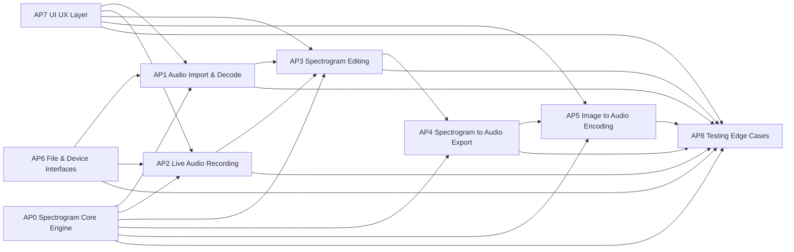

# APdependencies

```mermaid
flowchart LR
    %% Core
    AP0[AP0 Spectrogram Core Engine]

    %% Foundations
    AP6[AP6 File & Device Interfaces]
    AP7[AP7 UI UX Layer]

    %% Producers
    AP1[AP1 Audio Import & Decode]
    AP2[AP2 Live Audio Recording]

    %% Editor
    AP3[AP3 Spectrogram Editing]

    %% Reverse / Export
    AP4[AP4 Spectrogram to Audio Export]

    %% Alternate Producer
    AP5[AP5 Image to Audio Encoding]

    %% Testing
    AP8[AP8 Testing Edge Cases]

    %% Dependencies
    AP6 --> AP1
    AP6 --> AP2

    AP7 --> AP1
    AP7 --> AP2
    AP7 --> AP3
    AP7 --> AP5

    AP0 --> AP1
    AP0 --> AP2
    AP0 --> AP3
    AP0 --> AP4
    AP0 --> AP5

    AP1 --> AP3
    AP2 --> AP3

    AP3 --> AP4

    AP4 --> AP5

    %% Testing depends on everything
    AP1 --> AP8
    AP2 --> AP8
    AP3 --> AP8
    AP4 --> AP8
    AP5 --> AP8
    AP6 --> AP8
    AP7 --> AP8
    AP0 --> AP8
```

