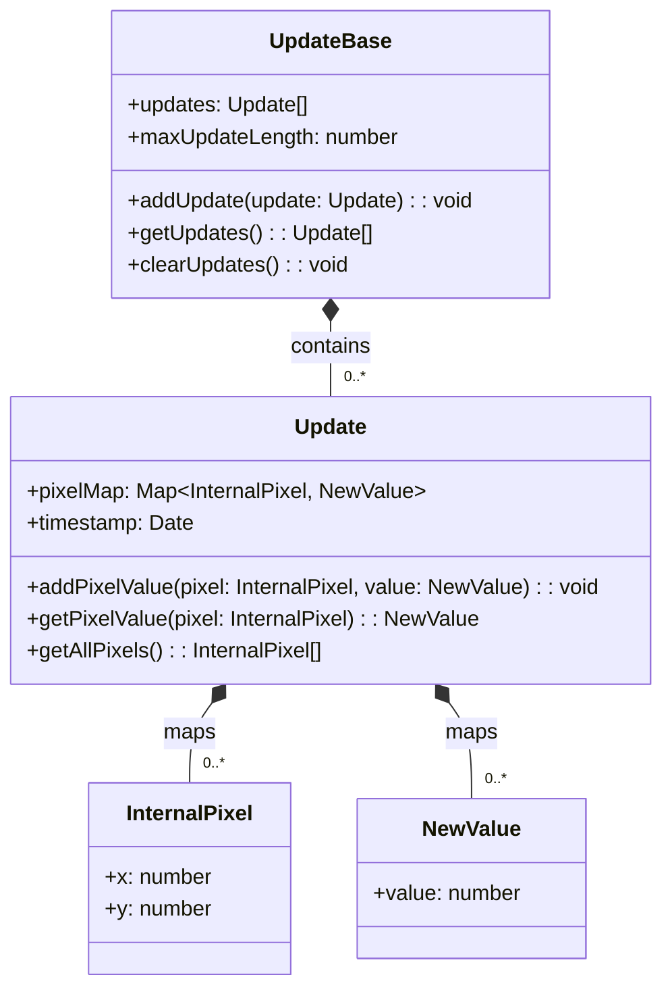

# Update Data Definition

<!--     note for UpdateBase "Stores array of updates with maximum length constraint"
    note for Update "Each update contains a map of pixel-to-value mappings"
    note for InternalPixel "Represents a pixel position in internal coordinate system"
    note for NewValue "Represents the new value to assign to a pixel" -->