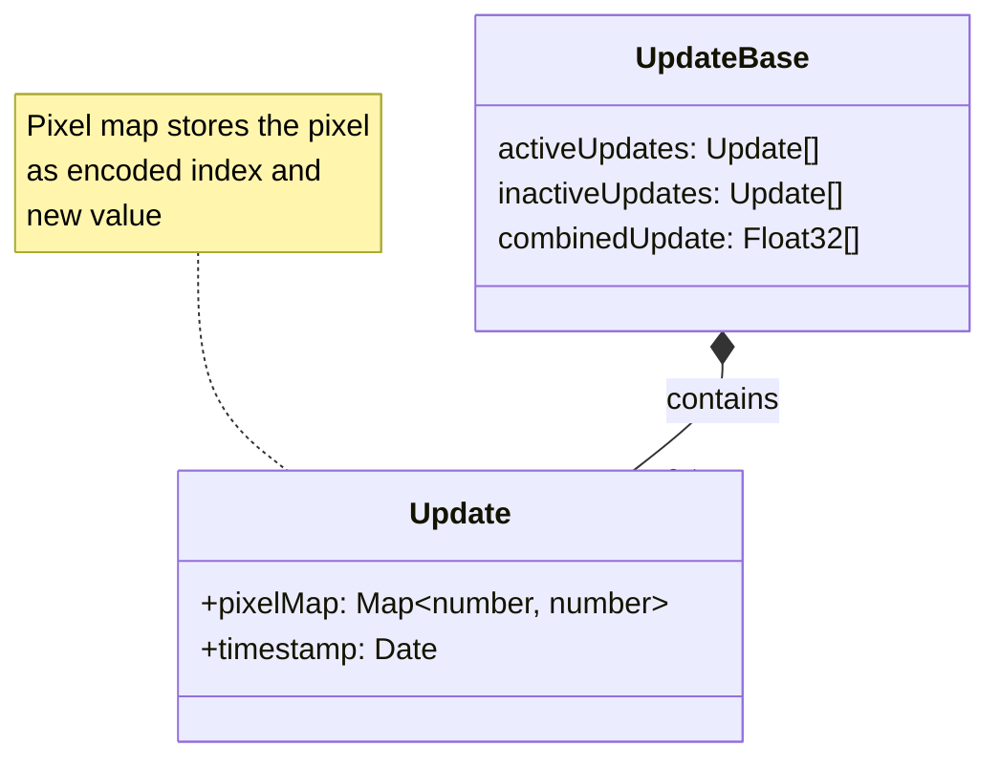

# Update Data Definition

```mermaid
classDiagram
    class UpdateBase {
        activeUpdates: Update[]
        inactiveUpdates: Update[]
        combinedUpdate: Float32[]    }

    class Update {
        +pixelMap: Map~number, number~
        +timestamp: Date
    }


    UpdateBase *-- "0..*" Update : contains


note for Update "Pixel map stores the pixel <br/> as encoded index and <br/> new value"
```
