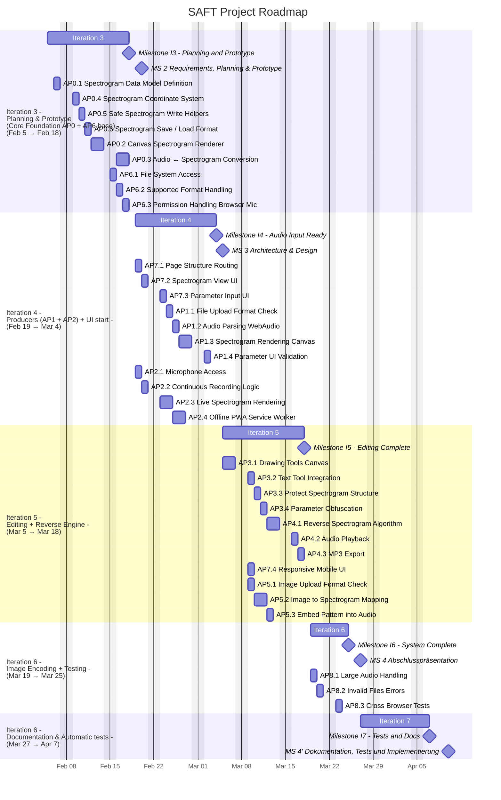

# Gantt

```mermaid
gantt
    title SAFT Project Roadmap
    dateFormat  YYYY-MM-DD
    axisFormat  %b %d
    excludes    weekends
    todayMarker stroke-width:.5, stroke:#ff0000


%% Iterations (from Github) every 9 days

%% -- Iteration 1 --
%% section Iteration 1 - Ideation - (Jan 8 → Jan 21)
%% Iteration 1                  :i1, 2026-01-08, 9d
%% Milestone I1 - Ideation          :milestone, mi1, 2026-01-21, 0d
%% -- Iteration 2 --
%% section Iteration 2 - Reqs - (Jan 22 → Feb 4)
%% Iteration 2                  :i2, 2026-01-22, 9d
%% Milestone I2 - Requirements          :milestone, mi2, 2026-02-04, 0d

%% -- Iteration 3 --
  section Iteration 3 - <br/> Planning & Prototype <br/>(Core Foundation AP0 + AP6 base) - <br/>(Feb 5 → Feb 18)
  Iteration 3                  :i3, 2026-02-05, 9d
  Milestone I3 - Planning and Prototype   :milestone, mi3, 2026-02-18, 0d
  MS 2 Requirements, Planning & Prototype : milestone, ms2, 2026-02-20, 0d
  
  %% -- Working Packages
  AP0.1 Spectrogram Data Model Definition     :ap0_1, 2026-02-06, 1d
  AP0.4 Spectrogram Coordinate System         :ap0_4, after ap0_1, 1d
  AP0.5 Safe Spectrogram Write Helpers        :ap0_5, after ap0_4, 1d
  AP0.6 Spectrogram Save / Load Format        :ap0_6, after ap0_5, 1d
  AP0.2 Canvas Spectrogram Renderer           :ap0_2, after ap0_6, 2d

  % kritische Komponente
  AP0.3 Audio ↔ Spectrogram Conversion  :crit :ap0_3, after ap0_2, 2d

  AP6.1 File System Access                    :ap6_1, 2026-02-15, 0.5d
  AP6.2 Supported Format Handling             :ap6_2, after ap6_1, 1d
  AP6.3 Permission Handling Browser Mic       :ap6_3, after ap6_2, 0.5d


%% -- Iteration 4 --
  section Iteration 4 - <br/>Producers (AP1 + AP2) + UI start - <br/>(Feb 19 → Mar 4)
  Iteration 4                  :i4, 2026-02-19, 9d
  Milestone I4 - Audio Input Ready          :milestone, mi4, 2026-03-04, 0d
  MS 3 Architecture & Design              : milestone, ms3, 2026-03-05, 0d
  
  %% -- Working Packages
  AP7.1 Page Structure Routing              :ap7_1, 2026-02-19, 1d
  AP7.2 Spectrogram View UI                 :ap7_2, after ap7_1, 1d
  AP7.3 Parameter Input UI                  :ap7_3, after ap7_2, 1d
  
  AP1.1 File Upload Format Check            :ap1_1, after ap7_3, 0.75d
  AP1.2 Audio Parsing WebAudio              :ap1_2, after ap1_1, 1.25d
  AP1.3 Spectrogram Rendering Canvas        :ap1_3, after ap1_2, 1.5d
  AP1.4 Parameter UI Validation             :ap1_4, after ap1_3, 1d
  
  AP2.1 Microphone Access                   :ap2_1, 2026-02-19, 0.75d
  AP2.2 Continuous Recording Logic          :ap2_2, after ap2_1, 1.25d
  AP2.3 Live Spectrogram Rendering          :ap2_3, after ap2_2, 1.5d
  AP2.4 Offline PWA Service Worker          :ap2_4, after ap2_3, 1.5d

%% -- Iteration 5 --
  section Iteration 5 - <br/>Editing + Reverse Engine - <br/>(Mar 5 → Mar 18)
  Iteration 5                  :i5, 2026-03-05, 9d
  Milestone I5 - Editing Complete          :milestone, mi5, 2026-03-18, 0d
  
  %% -- Working Packages
  AP3.1 Drawing Tools Canvas                :ap3_1, 2026-03-05, 1.75d
  AP3.2 Text Tool Integration               :ap3_2, after ap3_1, 1.25d
  AP3.3 Protect Spectrogram Structure       :ap3_3, after ap3_2, 1.25d
  AP3.4 Parameter Obfuscation               :ap3_4, after ap3_3, 1d
  
  AP4.1 Reverse Spectrogram Algorithm       :ap4_1, after ap3_4, 1.75d
  AP4.2 Audio Playback                      :ap4_2, after ap4_1, 0.5d
  AP4.3 MP3 Export                          :ap4_3, after ap4_2, 1d
  AP7.4 Responsive Mobile UI               :ap7_4, after ap3_1, 1d

  AP5.1 Image Upload Format Check          :ap5_1, after ap3_1, 0.75d
  AP5.2 Image to Spectrogram Mapping       :ap5_2, after ap5_1, 1.75d
  AP5.3 Embed Pattern into Audio           :ap5_3, after ap5_2, 1.25d


%% -- Iteration 6 --
  section Iteration 6 - <br/>Image Encoding + Testing - <br/>(Mar 19 → Mar 25)
  Iteration 6                  :i6, 2026-03-19, 4d
  Milestone I6 - System Complete          :milestone, mi6, 2026-03-25, 0d
  MS 4 Abschlusspräsentation              :milestone, ms4, 2026-03-27, 0d
  
  %% -- Working Packages
  
  AP8.1 Large Audio Handling               :ap8_1, 2026-03-19, 1d
  AP8.2 Invalid Files Errors               :ap8_2, after ap8_1, 0.75d
  AP8.3 Cross Browser Tests                :ap8_3, after ap8_2, 1d


%% -- Iteration 7 --
  section Iteration 6 - <br/>Documentation & Automatic tests - <br/>(Mar 27 → Apr 7)
  Iteration 7                  :i7, 2026-03-27, 7d
  Milestone I7 - Tests and Docs          :milestone, mi7, 2026-04-07, 0d
  MS 4' Dokumentation, Tests und Implementierung              :milestone, ms4b, 2026-04-10, 0d
  
  %% -- Working Packages
  

```
