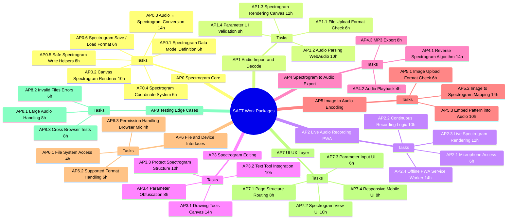

# Projektstrukturplan
hier ist der Projektstrukturplan

```mermaid
mindmap
  root((SAFT Work Packages))

    AP0 Spectrogram Core
      Tasks
        AP0.1 Spectrogram Data Model Definition 6h
        AP0.2 Canvas Spectrogram Renderer 10h
        AP0.3 Audio ↔ Spectrogram Conversion 14h
        AP0.4 Spectrogram Coordinate System 6h
        AP0.5 Safe Spectrogram Write Helpers 8h
        AP0.6 Spectrogram Save / Load Format 6h

    AP1 Audio Import and Decode
      Tasks
        AP1.1 File Upload Format Check 6h
        AP1.2 Audio Parsing WebAudio 10h
        AP1.3 Spectrogram Rendering Canvas 12h
        AP1.4 Parameter UI Validation 8h

    AP2 Live Audio Recording PWA
      Tasks
        AP2.1 Microphone Access 6h
        AP2.2 Continuous Recording Logic 10h
        AP2.3 Live Spectrogram Rendering 12h
        AP2.4 Offline PWA Service Worker 14h

    AP3 Spectrogram Editing
      Tasks
        AP3.1 Drawing Tools Canvas 14h
        AP3.2 Text Tool Integration 10h
        AP3.3 Protect Spectrogram Structure 10h
        AP3.4 Parameter Obfuscation 8h

    AP4 Spectrogram to Audio Export
      Tasks
        AP4.1 Reverse Spectrogram Algorithm 14h
        AP4.2 Audio Playback 4h
        AP4.3 MP3 Export 8h

    AP5 Image to Audio Encoding
      Tasks
        AP5.1 Image Upload Format Check 6h
        AP5.2 Image to Spectrogram Mapping 14h
        AP5.3 Embed Pattern into Audio 10h

    AP6 File and Device Interfaces
      Tasks
        AP6.1 File System Access 4h
        AP6.2 Supported Format Handling 6h
        AP6.3 Permission Handling Browser Mic 4h

    AP7 UI UX Layer
      Tasks
        AP7.1 Page Structure Routing 8h
        AP7.2 Spectrogram View UI 10h
        AP7.3 Parameter Input UI 6h
        AP7.4 Responsive Mobile UI 8h

    AP8 Testing Edge Cases
      Tasks
        AP8.1 Large Audio Handling 8h
        AP8.2 Invalid Files Errors 6h
        AP8.3 Cross Browser Tests 8h
```
