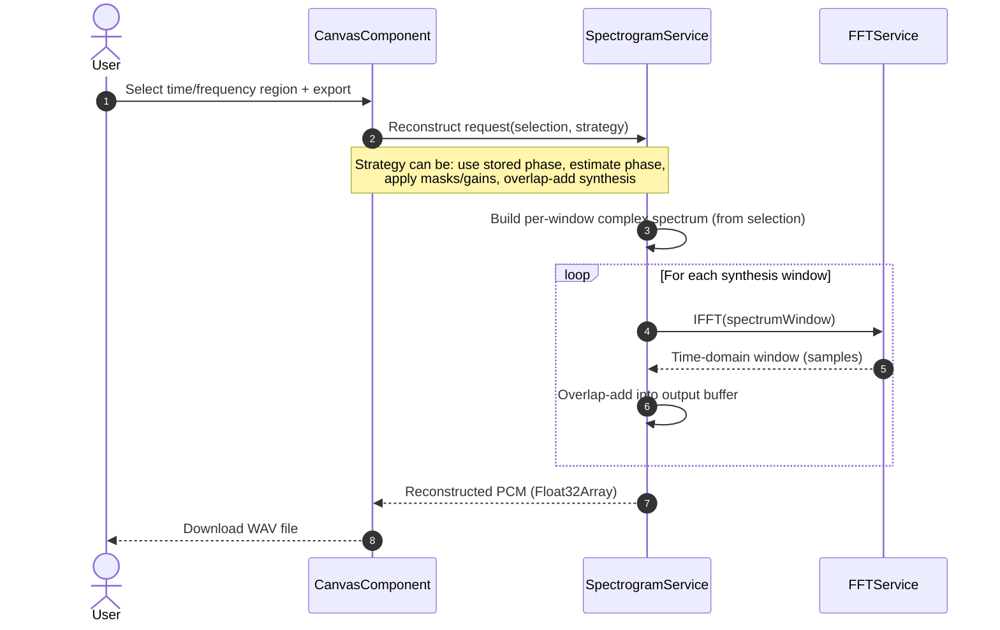

# Export

```mermaid
sequenceDiagram
  autonumber
  actor User
  participant Canvas as CanvasComponent
  participant Spec as SpectrogramService
  participant FFT as FFTService

    User->>Canvas: Select time/frequency region + export
    Canvas->>Spec: Reconstruct request(selection, strategy)
    Note over Canvas,Spec: Strategy can be: use stored phase, estimate phase,<br/> apply masks/gains, overlap-add synthesis

    Spec->>Spec: Build per-window complex spectrum (from selection)
    loop For each synthesis window
      Spec->>FFT: IFFT(spectrumWindow)
      FFT-->>Spec: Time-domain window (samples)
      Spec->>Spec: Overlap-add into output buffer
    end

    Spec-->>Canvas: Reconstructed PCM (Float32Array)
    Canvas-->>User: Download WAV file

```